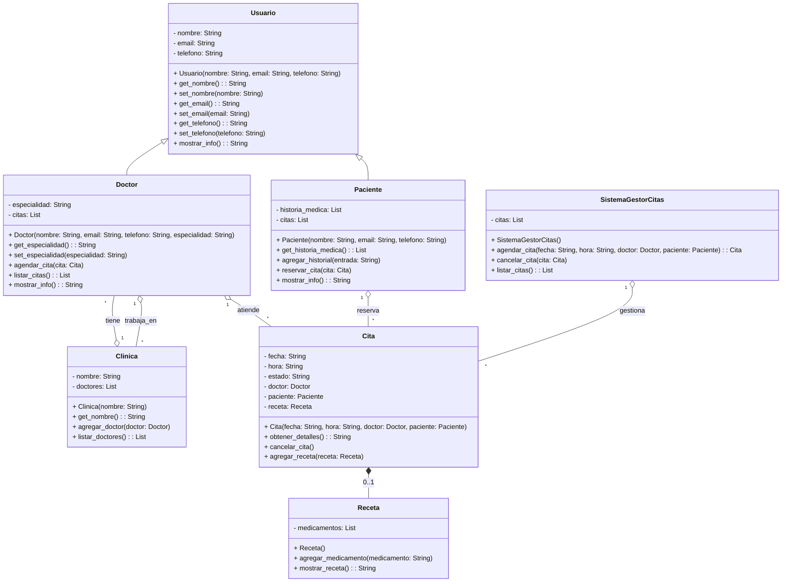

# PRODUCTO ACADEMICO 1 
Sistema de Gestión de Citas Médicas
*Descripción
Este proyecto permite la administración de citas médicas en una clínica, gestionando pacientes, doctores, historiales médicos y recetas.

*conceptos aplicados 
- Encapsulamiento: Uso de getters y setters.
- Herencia: Paciente y Doctor heredan de Usuario.
- Polimorfismo: Métodos sobrescritos para mostrar información.
- Relaciones UML:

Composición: Cita contiene Receta.
Agregación: Doctor trabaja en Clínica.
Asociación: Cita vincula Paciente y Doctor.

Tecnologías usadas 
-Python (POO)
-Visual Studio Code
-Diagramas UML (Clases y Casos de Uso)

DIAGRAMA DE  CASOS DE  USO  DE NUESTRO SISTEMA 

```mermaid 
graph TD
    %% Definimos los actores principales
    actorPaciente[Paciente] -->|Solicita| UC_ReservarCita["Reservar Cita"]
    actorPaciente -->|Cancela| UC_CancelarCita["Cancelar Cita"]
    actorPaciente -->|Consulta| UC_VerHistorial["Ver Historial Médico"]

    actorDoctor[Doctor] -->|Atiende| UC_AtenderCita["Atender Cita"]
    actorDoctor -->|Registra| UC_RegistrarReceta["Registrar Receta"]

    actorAdmin[Administrador] -->|Gestiona| UC_GestionarClinica["Gestionar Clínica"]
    actorAdmin -->|Configura| UC_AdministrarDoctores["Administrar Doctores"]

    %% Relacionamos casos de uso con el sistema principal
    subgraph SistemaGestorCitas
        UC_ReservarCita --> UC_RegistrarCita["Registrar Cita en el Sistema"]
        UC_CancelarCita --> UC_ModificarCita["Modificar/Cambiar Estado de la Cita"]
        UC_AtenderCita --> UC_FinalizarCita["Finalizar Cita en el Sistema"]
    end

    subgraph Clinica
        UC_GestionarClinica --> UC_AdministrarDoctores
    end

    %% Relación entre casos de uso
    UC_RegistrarReceta --> UC_AtenderCita
